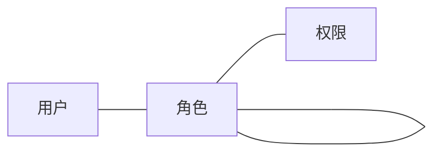
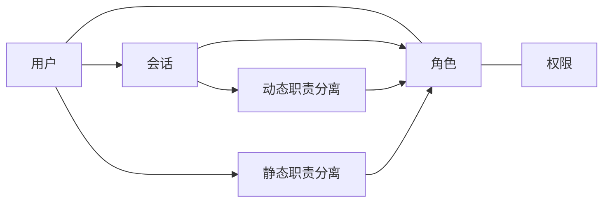
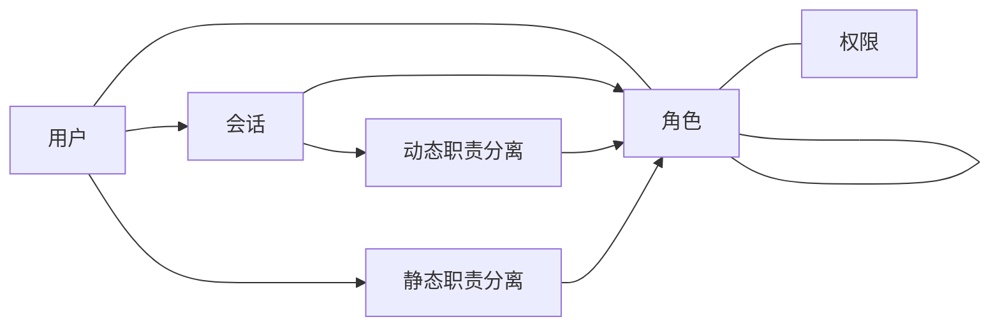

# Role-Based Access Control

基于角色的访问控制

## 基本概念

### 用户 User

医院信息系统用户可分为两种：2B和2C，即 to B 的后台管理系统用户、医院职工和 to C 的患者。

### 角色 Role

角色连接用户和权限。一个角色可以拥有多个权限，一个用户可以拥有多个角色。向用户授权时，关联相关角色即可。

> 在用户基数很大，且可以被分类到不同角色时，通过关联相关角色来进行授权就变得麻烦了。

### 权限 Permission

包括两个方面：资源对象和操作类型。即可以对资源对象做出何种操作，例如能够对页面进行访问，对数据进行访问、删除。

## RBAC 模型

### RBAC0

### RBAC1

角色加入继承关系。

一般继承：支持多继承；

受限继承：树状。

### RBAC2

加入授权时应遵循的强制性规则。例如，一个用户不应该同时具有出纳和会计两个角色的权限

动态职责分离 DSD

静态职责分离 SSD

### RBAC3

同时具有 RBAC1 和 RBAC2。

## 模型扩展

### 用户组

当用户基数很大时，让用户关联到角色来进行授权的方式并不理想。该方式直接对最小授权实体进行授权，管理起来很困难，因此需要进行分层和抽象。

我们将具有相同特征的用户分类到同一用户组，然后对用户组进行角色关联，从而对属于该用户组的全部用户进行授权管理。

### 部门与职位

部门和职位可以认为是特殊的用户组。它们相对固定，其权限不经常变动，而且具有上下级关系。

### 一般用户组

可以作为临时项目组的权限管理对象。它不与组织架构相关，里面的用户可以来自不同部门、不同职位。

### 授权流程

手动授权：管理员进行操作。

审批授权：用户提交职位申请，上级审批后直接授权。

