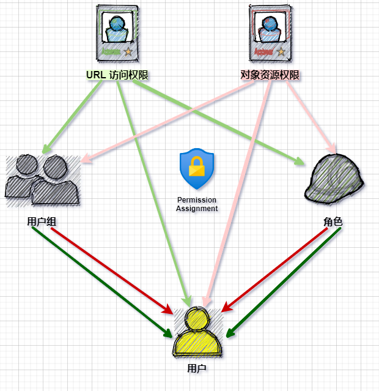

# RBAC Manual

> 医院信息系统——基于角色的访问控制（RBAC）说明书。
>
> Author: zyc

医院信息系统需要对用户权限进行管理，以保证数据安全性。根据需求与实现的复杂度，HIS使用基于URL和资源对象的 RBAC 权限管理系统。由于 Django 仅支持数据库层面的大粒度权限与权限组，因此基于 `Django.contrib.auth` 模块开发 `HIS.rbac` 模块。

## 基本说明

`HIS.rbac` 包含两个权限系统，分别控制**URL访问**和**数据库特定数据行**的权限。

### 对象资源权限 Object Permission

包括三个方面：数据库对象、行级资源对象和操作类型。即可以对特定数据库的某个数据行做出何种操作，例如能够对内科1号患者数据进行访问（患者数据库 + row: 1 + 访问）。

### URL 访问权限 URL Permission

控制系统用户能够访问的页面。即能否访问特定的URL。

### 用户 User

包括医院职工、大型设备与机器等。由于C端用户（患者）不应该深入使用医院内部的信息系统，因此患者使用另外一套及其简单的权限管理方式。

### 角色 Role

角色作为多个相似权限的集合，用于简化向用户分配权限的过程。一个角色可以拥有多个权限，一个用户可以拥有多个角色。向用户授权时，关联相关角色即可。

### 用户组 UserGroup

在用户基数很大时，通过将相关角色关联到一个个用户来进行授权会变得十分麻烦。这时使用用户组来汇集具有相同权限和角色特点的用户。

## 权限分配与数据库设计

### 用户权限来源图

### ER图

### UML 类图

## 使用说明

要使用 `HIS.rbac`，请按照以下步骤进行设置：

`settings.py`

- `INSTALLED_APPS` 中加入 `'rbac'`，启用 RBAC 应用；
- `MIDDLEWARE` 中加入 `"rbac.middleware.rbac.RBACMiddleware"`，启用 RBAC 中间件，用于鉴别是否拥有 URL 访问权限；
- 加入设置：`AUTH_USER_MODEL = "rbac.UserInfo"`，指定自定义的认证用户模型；
- 加入设置：`AUTHENTICATION_BACKENDS = (rbac.backends.CustomBackends", )`，设置认证后端，实现上述两个权限模型的获取与处理；
- 加入设置：`PERMISSION_URL_KEY = "url_key"`，指定 session 中用户全部 URL 访问权限的键；
- 加入设置：`PERMISSION_OBJ_KEY = "obj_key"`，指定 session 中用户全部对象资源权限的键；
- 加入设置：`SAFE_URL = [...]`，指定无需登录也可访问的 URL。

## 测试用例

### 权限预定义与预分配

1. URL 访问权限：

2. 对象访问权限：

3. 角色：

|  ID  |      Role      |  URL Perm  | OBJ Perm  |
| :--: | :------------: | :--------: | :-------: |
|  1   |  HIS 开发人员  | All (1-10) | All (1-9) |
|  2   | HIS 测试工具人 |    1, 2    |   1, 2    |
|  3   | 内科住院部医生 |    3, 4    |   3, 4    |
|  4   |  外科门诊医生  |    5, 6    |   5, 6    |

4. 用户组：

|  ID  | UserGroup |  URL Perm  | OBJ Perm  |
| :--: | :-------: | :--------: | :-------: |
|  1   | HIS开发部 | All (1-10) | All (1-9) |
|  2   | HIS测试部 |   9, 10    |   8, 9    |
|  3   |   内科    |    7, 8    |   6, 7    |
|  4   |   外科    |    5, 6    |   4, 5    |

### 用户权限分配

用户：

|  User  |  Total URL Perms  | Total OBJ Perms  | Roles | UserGroups | URL Perms | OBJ Perms |
| :----: | :---------------: | :--------------: | :---: | :--------: | :-------: | :-------: |
|  zyc   |    All (1-10)     |    All (1-9)     |   1   |     1      |           |           |
| 000000 |    1, 2, 9, 10    |    1, 2, 8, 9    |   2   |     2      |           |           |
| 000001 |    1, 2, 7, 8     |    1, 2, 6, 7    |   2   |     3      |           |           |
| 000002 |    1, 2, 5, 6     |    1, 2, 4, 5    |   2   |     4      |           |           |
| 000003 | 1, 2, 7, 8, 9, 10 | 1, 2, 6, 7, 8, 9 |   2   |    2, 3    |           |           |
| 000004 |    All (1-10)     |    All (1-9)     | 2, 3  |  2, 3, 4   |           |           |
| 000005 |  1, 2, 5, 9, 10   |  1, 2, 5, 8, 9   |   2   |     2      |     5     |     5     |
| 000006 |   1, 2, 7, 8, 9   |  1, 2, 3, 6, 7   |   2   |     3      |  7, 8, 9  |  1, 2, 3  |
| 000007 |    1, 2, 3, 4     |     2, 3, 4      |   3   |            |   1, 2    |   2, 3    |
| 000008 |    4, 5, 6, 7     |    3, 4, 5, 6    |       |     4      |   4, 7    |   3, 6    |
| 000009 |     1, 5, 10      |     2, 6, 9      |       |            | 1, 5, 10  |  2, 6, 9  |

### 结果

测试用例全部通过。

## 未来开发方向

`HIS.rbac` 只完成了 RBAC0 级别的权限管理系统，如下图所示：

未来可以进一步完善 RBAC 系统，加入角色的继承机制，达到 RBAC1：

或者加入授权时应遵循的强制性规则，完成动态职责分离（DSD）、静态职责分离（SSD）：

> 例如，一个用户不应该同时具有出纳和会计两个角色的权限。
>

或者，使系统同时具有 RBAC1 和 RBAC2 的特点，达到 RBAC3：

## 